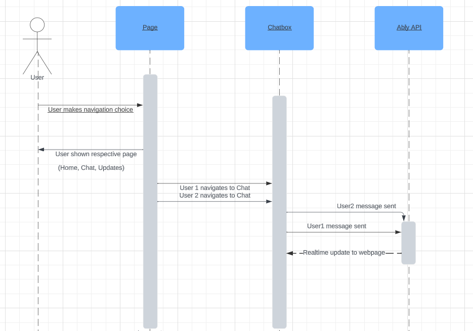

## ChatApp Created with NextJS and Ably

First, run the development server:

```bash
npm run dev
```
### Instructions
- Navigate to Chat tab, input text and hit submit
- Open Chat window in second tab, and send response in chat
- Chat is updated in real-time
### Future improvements

- add usernames
- see prior chat history when joining room
- implement room function
### Screenshots


